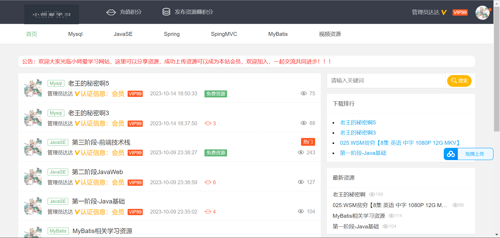
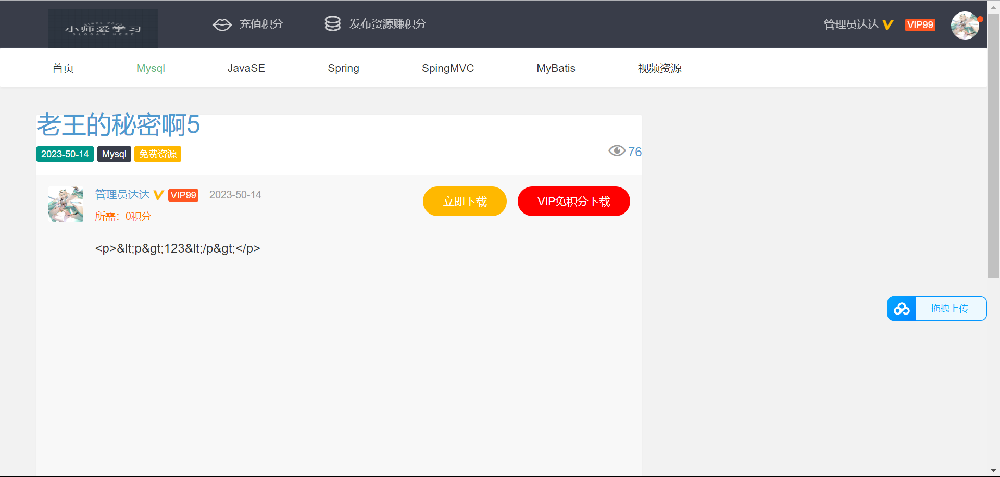
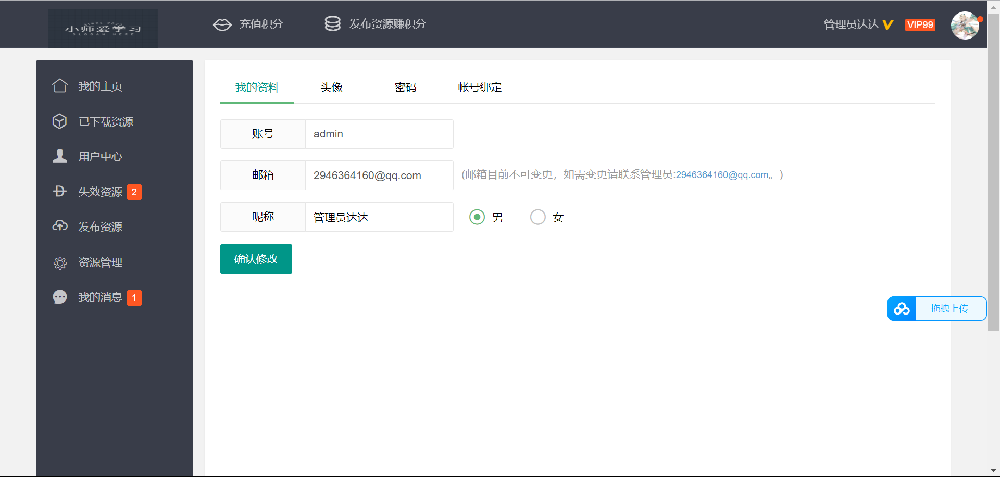
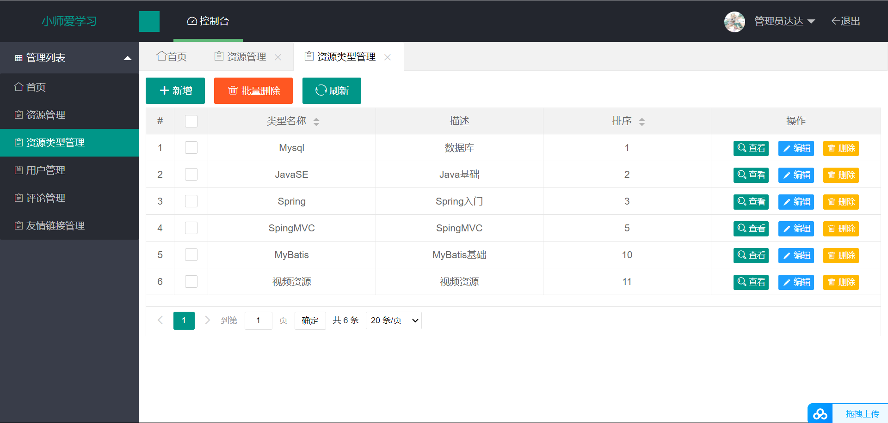
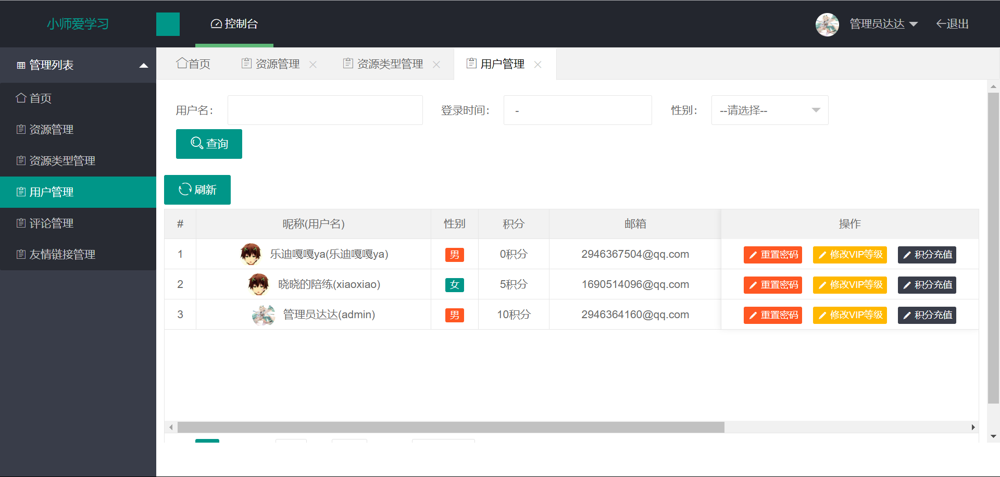
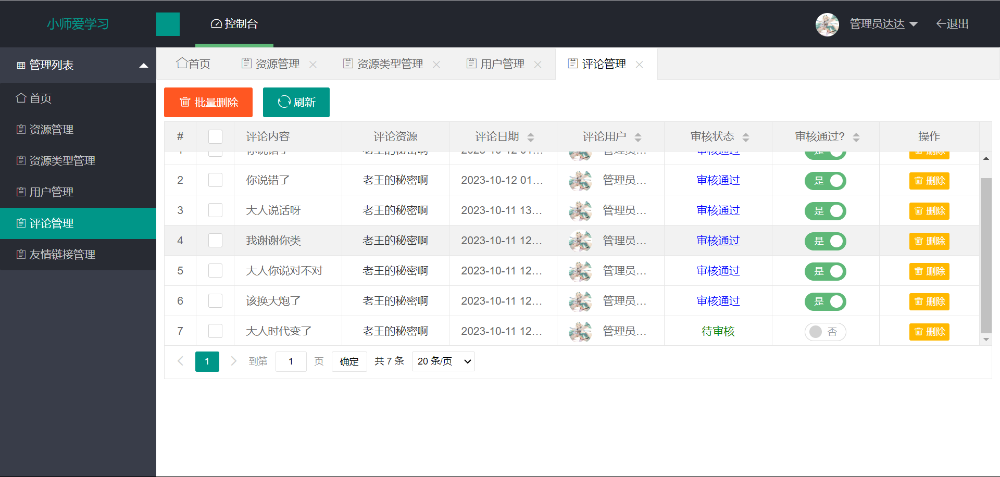
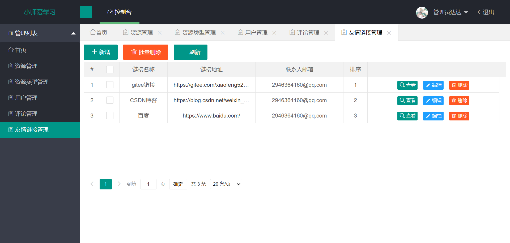

# 基于SpringBoot的资源网系统

> 大家好！欢迎关注程序员小师，今天给大家带来的一个项目是：基于SpringBoot的资源网系统，这是一个学习网站，也是一个分享网站。项目包含登录注册模块、文章管理模块、文章分类模块、用户管理模块、消息模块、友链管理模块等...如果你正在接触SpringBoot想做一个自己的项目那么就来试试看吧，感兴趣的接着往下看吧，喜欢的可以给了关注💕和start

##  介绍

> 基于SpringBoot的资源网系统,本项目分为前台和后台，用户有普通用户和管理员，普通用户只可访问前台页面，管理员可以访问后台； 前台主要功能有文章的访问，发布文章，购买VIP/充值积分、修改用户状态等；后端管理员可以管理文章、管理用户、管理文章分类；管理消息、更改积分等。

## 项目特点：

项目本身难度不复杂，代码量不是很多，但是更注重逻辑的考察，重点理解业务能力是关键。经过学习大家绝对可以实现做出来属于自己的项目，获得满满的自豪感。

## 技术选型：

开发工具：

- jdk 1.8
- Idea 19.3.3
- Navicat或者SQLyog
- 虚拟机或者云系统：Vmware,SecureCRT(或者【Xshell，Xftp】putty,) ，都可以
- 虚拟机：centos7.0+ (ubuntu)
- Redis客户端：RedisDesktopManager
- 浏览器：Chrome

数据库：

- mysql    5.7以上都行

前端：

- thymeleaf模板
- easyui组件库
- ueditor富文本组件

后端：

- SpringBoot
- shiro 安全框架
- javamail 集成短信，找回密码等
- Druid 连接池
- lucene 全文检索

缓存:

- redis

第三方登录：

QQ:（这里需要申请等待中🥰.....)

## 项目展示

### 前端：

#### 首页：

#### 文章详情页：

#### 搜索页面：

#### 用户中心页面:

#### 资源管理页面：

#### 下载失效页面：

#### 用户修改页面：

#### 购买VIP页面：

#### 充值积分页面：

### 后端：

#### 登录页：

#### 管理员首页：

#### 文章管理页面：

#### 类型管理页面：

#### 用户管理页面：

#### 评论管理页面:

#### 友链管理：

## 总结收获：

- 学到开发中的一些逻辑问题思考
- 学习系统设计的合理性和准确性
- 做完整个项目，你会有满满的收获，自豪感
- 学习代码的优化，常用的一些抽离出来当作工具使用
- 学习Shiro的使用，做权限控制
- 学习redis的使用，存储的一些小技巧
- 学习lucene的使用，做本地缓存加快访问速度
- 学习阅读代码技巧，提升自己主动解决问题的能力

##  免责声明

1.本项目提供的源代码仅用学习，请勿用于商业盈利。

2.用户使用本系统从事任何违法违规的事情，一切后果由用户自行承担，作者不承担任何责任。

3.如有侵犯权利，请联系作者删除。

4.下载本站源码则代表你同意上述的免责声明协议。

<mark>有问题可以提交问题，喜欢交朋友，喜欢💕这个项目的可以给个start和给作者一个关注。</mark>

<mark>也欢迎关注作者的博客：[http://t.csdn.cn/fVZm9](https://gitee.com/link?target=https%3A%2F%2Fblog.csdn.net%2Fweixin_46585492) (目前在更算法文章喜欢可以关注一下)</mark>

<mark>联系方式：</mark>

<mark>QQ：2946364160</mark>

